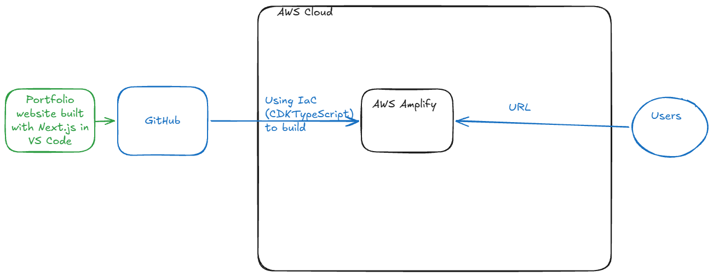

This is a portfolio project using:

<ul>
<li>GitHub Actions</li>
<li>AWS Amplify</li>
<li>Next.js</li>
</ul>

Medium blog post: <a href="https://medium.com/@gkinthaert/and-now-for-something-different-hosting-a-static-site-but-with-aws-amplify-and-cdk-56d05d2121d3">And now for something different: Hosting a static site, but with AWS Amplify and CDK</a>
